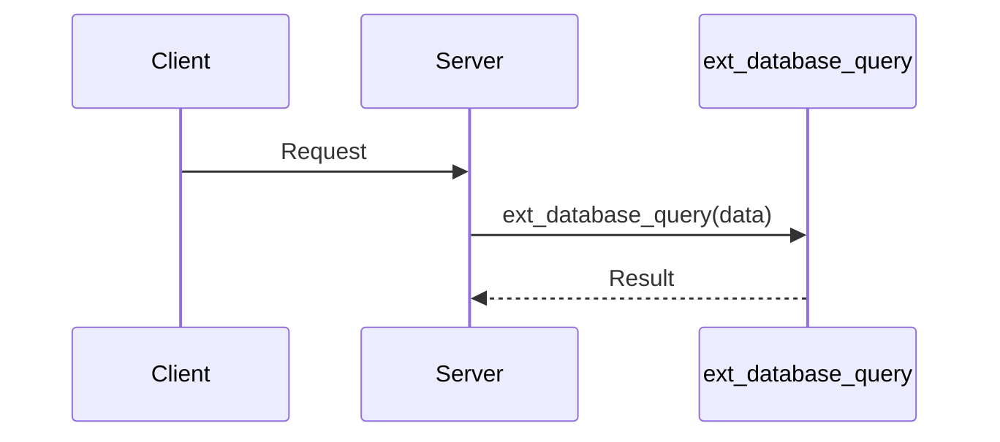

# Traceability Features Summary

This document summarizes the enhanced traceability features In Progress for linking user stories, system tests, sequence diagrams, and external API calls.

## Key Components

### 1. **TRACEABILITY_NAMING_RULE.md**
Defines naming conventions for:
- System tests: `test_<STORY_ID>_<DIAGRAM_ID>_<SCENARIO>`
- Sequence diagrams: `SD<NUMBER>_<FEATURE>_<FLOW>.mermaid`
- External functions: `ext_<SERVICE>_<ACTION>`
- User stories: `US<NUMBER>_<EPIC>_<TITLE>`

### 2. **Mermaid Parser** (`src/utils/mermaid-parser.ts`)
- Parses Mermaid sequence diagrams
- Extracts external API participants
- Identifies external function calls
- Validates actual vs expected calls

### 3. **External Call Tracker** (`src/logging/external-call-tracker.ts`)
- Tracks all external function calls
- Records function name, duration, args, results
- Associates calls with test context
- Provides statistics and coverage

### 4. **External Log Library** (`src/logging/external-log-lib.ts`)
- Central hub for all external logging
- Integrates network, database, and call tracking
- Auto-instruments common libraries
- Generates comprehensive reports

### 5. **Enhanced Story Reporter** (`src/agents/enhanced-story-reporter.ts`)
- Tracks system test execution
- Reports test coverage metrics
- Validates sequence diagram compliance
- Links tests to user stories
- Generates comprehensive story reports

## Features

### Test Coverage Tracking
```json
{
  "testName": "test_US001_SD001_login",
  "coverage": {
    "statements": 95.5,
    "branches": 88.2,
    "functions": 100,
    "lines": 94.8
  }
}
```

### Sequence Diagram Validation
- Automatically validates that external calls in tests match sequence diagram expectations
- Reports missing or unexpected external calls
- Links test execution to design documentation

### External Call Monitoring
```typescript
// Automatic tracking with naming convention
@TrackExternalCall('ext_database_query')
async queryDatabase(sql: string) {
  // Implementation
}

// Manual tracking
const trackedFetch = trackExternal('ext_http_request', fetch);
```

### Story Reports Include
1. **Test Results**: Pass/fail status with coverage
2. **Sequence Diagrams**: Linked diagrams with validation
3. **External Calls**: All external API calls made
4. **Traceability Matrix**: Links between stories, tests, and diagrams

## Usage

### 1. Create Sequence Diagram


### 2. Write Test Following Convention
```typescript
describe('test_US001_SD001_user_login', () => {
  it('should validate user credentials', async () => {
    // Test will automatically be linked to US001 story and SD001 diagram
    const result = await login(username, password);
    expect(result).toBeTruthy();
  });
});
```

### 3. Run Enhanced Story Reporter
```javascript
const reporter = new EnhancedStoryReporter(serverUrl, roomId);
await reporter.connect();
// Reporter will automatically track tests and generate reports
```

### 4. View Comprehensive Report
Reports include:
- Story narrative
- Test execution results
- Coverage metrics
- Sequence diagram validation
- External API call analysis

## Benefits

1. **Full Traceability**: From requirements to implementation to test
2. **Automated Compliance**: Verify implementation matches design
3. **Coverage Visibility**: Know which stories have adequate testing
4. **External API Monitoring**: Track all external dependencies
5. **Design Documentation**: Sequence diagrams stay in sync with code

## Demo

Run the enhanced story reporter demo:
```bash
node demo/enhanced-story-reporter/demo.js
```

This demonstrates:
- Test execution with coverage reporting
- External call tracking
- Sequence diagram validation
- Comprehensive story reports